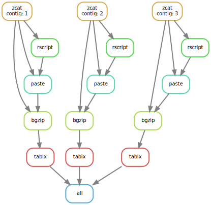

# VCF GrowR
Snakemake workflow that simulates large VCF files as input for imputation testing

### Information
This method will only copy/pastes the samples in each vcf file 10 times, it does not produce random data.  
Yes, it's hacky.  
It works for testing purposes.  

### Instructions
It runs in a docker container, install docker using the appropriate instructions here: https://docs.docker.com/install/  
If you already have docker installed you can run `./start-pipeline.sh` and it'll start making bigger vcf files using the ones in the hg19-vcfs directory.  
If you want to supply your own vcf files you need to have one vcf file per chromosome and replace the vcf files in the hg19-vcfs directory with your new ones, 
don't forget to index your vcf files with tabix too.

Cheers!
